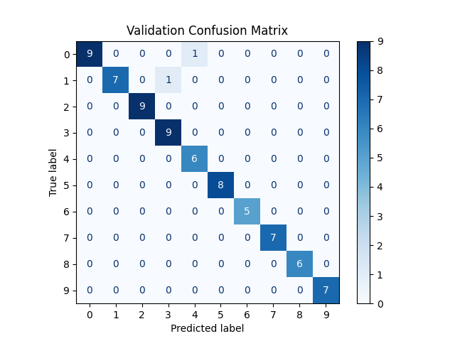

# 🖊️ Handwritten Digit Recognition with PyTorch

A beginner-friendly deep learning project that lets you **draw your own digits**, train a CNN to recognize them, and test it live — all from scratch.

---

## ✨ Features

- Draw and save your own handwritten digit dataset using a simple drawing tool
- Train a custom Convolutional Neural Network (`DigitNet`) built with PyTorch
- Evaluate model performance with accuracy metrics and an optional confusion matrix
- Test the trained model live by drawing digits in real time

---

## 🎨 Generating Data

Before training, you need to create your dataset using the included drawing tool.

```bash
python draw.py
```

A window will open where you can draw digits (0–9) with your mouse. Each drawing is saved as a labeled image to your local dataset directory. Aim for at least **50–100 samples per digit** for reasonable accuracy — the more, the better.

**Tips for a good dataset:**
- Vary your stroke size, angle, and position to make the model more robust
- Try to keep drawings centered in the canvas
- Draw slowly and clearly, especially for digits like `1`, `7`, and `9` that can look similar

---

## 🧠 Training the Model

Once your dataset is ready, train the CNN with:

```bash
python train.py
```

This script will:
1. Load and preprocess your drawn digit images
2. Split them into training and validation sets
3. Train `DigitNet`, a lightweight Convolutional Neural Network
4. Save the best model weights to `weights/digit_model.pth`
5. Print training loss and validation accuracy for each epoch

### About `DigitNet`

`DigitNet` is a custom CNN designed to be simple yet effective for digit classification. It uses two convolutional layers for feature extraction, followed by fully connected layers that map those features to one of 10 digit classes (0–9).

### Optional: Confusion Matrix

After training completes, a confusion matrix image is saved to:

```
assets/confusion_matrix.png
```

This visualization shows how well the model distinguishes between each digit — great for spotting which digits it confuses most often (e.g., `4` vs `9`, or `3` vs `8`).



---

## 🖥️ Live Testing

Test the trained model interactively by drawing digits in real time:

```bash
python active_test.py
```

Draw a digit in the pop-up window and the model will instantly display its prediction. Press a key to clear the canvas and try again. The model loads weights from `model.pth`, so make sure training has completed before running this script.

---

## 📦 Requirements

Install all dependencies with:

```bash
pip install -r requirements.txt
```

The project relies on the following libraries:

| Library | Purpose |
|---|---|
| `torch` | Neural network framework |
| `torchvision` | Image transforms and utilities |
| `numpy` | Array and data manipulation |
| `opencv-python` | Drawing canvas and image handling |
| `matplotlib` | Plotting the confusion matrix |
| `scikit-learn` | Confusion matrix computation |
| `Pillow` | Image loading and preprocessing |

> **Python version:** 3.8 or higher is recommended.

---

## 📝 Notes

- **No GPU required** — the model is small enough to train quickly on a CPU, though a CUDA-compatible GPU will speed things up significantly. Training will automatically use a GPU if one is available.
- **Dataset quality matters more than quantity** — 50 clean, varied samples per digit will outperform 200 rushed ones.
- **Model file** — `digit_model.pth` is overwritten each time you run `train.py`. Back it up if you want to keep a previous version.
- **Retraining** — if live test accuracy feels low, try generating more diverse data and retraining. Small datasets are sensitive to how consistently you draw.
- **Canvas size** — all drawn images are automatically resized to `28×28` grayscale before being fed to the model, matching the format the network was trained on.

---

## 🚀 Quick Start

```bash
# 1. Generate your dataset
python draw.py

# 2. Train the model
python train.py

# 3. Test it live
python active_test.py
```

---

*Built with PyTorch. Contributions and improvements are welcome — feel free to open an issue or pull request!*